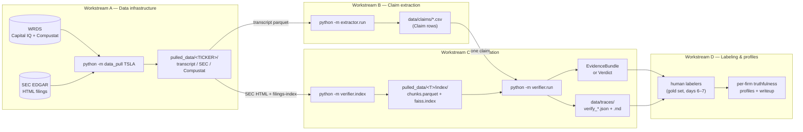
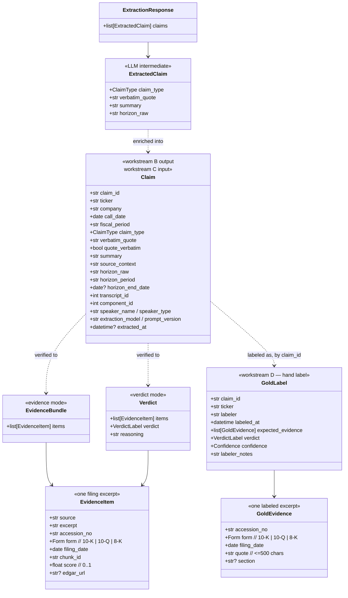
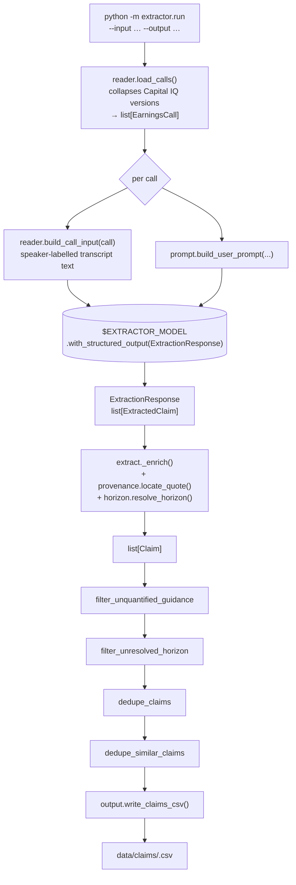
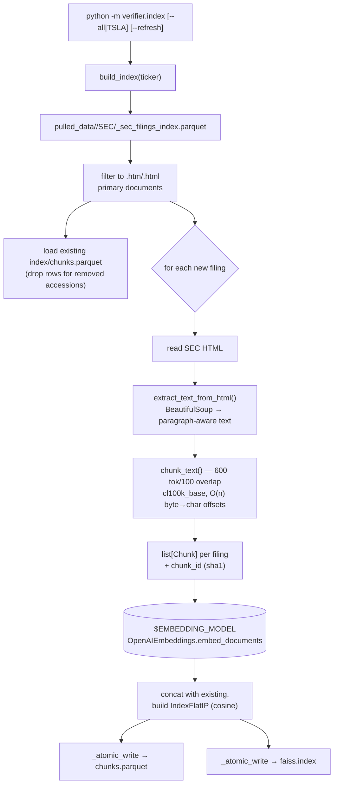
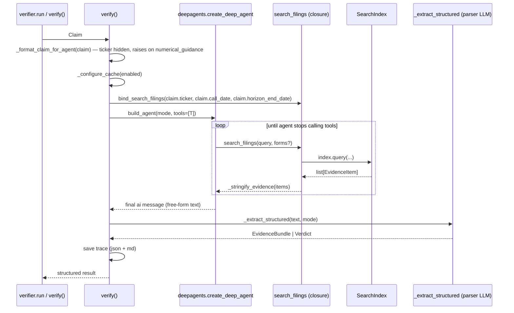
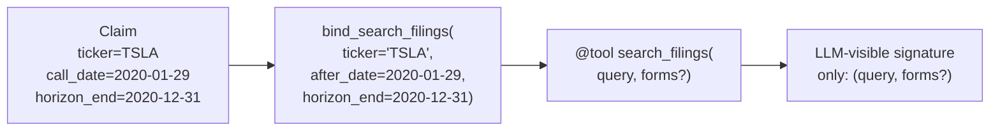
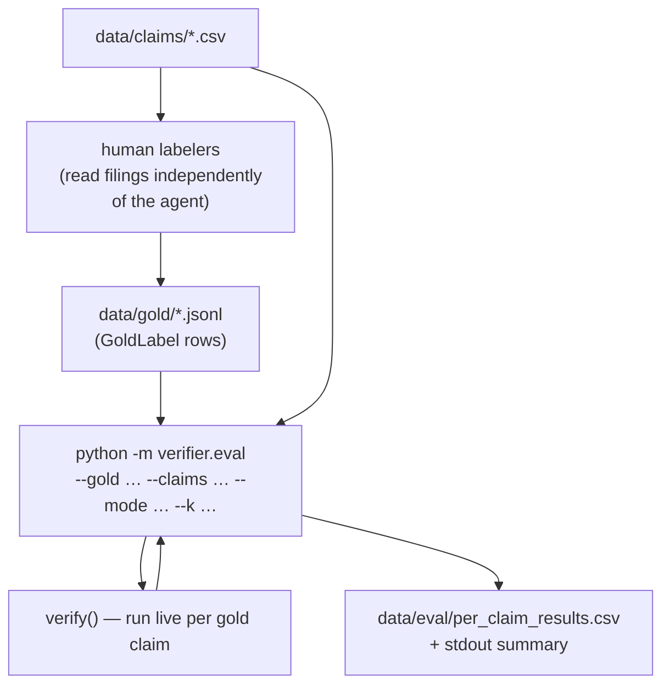

# Architecture & dataflow

A first-read map of the codebase. Each section names the modules involved, the
shapes flowing between them, and the on-disk artifacts each stage writes.

For project goals, scope, and team see `CLAUDE.md`. For setup and CLI ergonomics
see `README.md`. For deferred work see `docs/future_optimizations.md`.

---

## 1. End-to-end pipeline

The system turns one earnings call into a set of *forward-looking management
claims*, each accompanied by *cited evidence* drawn from the same firm's
subsequent SEC filings. A human labeler then reads each (claim, evidence)
pair and assigns a verdict.



**Load-bearing invariant.** The arrow from C into D is `EvidenceBundle` —
evidence-only, **no verdict field by schema construction**. Letting the agent
propose a verdict would bias the labeler. The agent's verdict mode exists for
spot-checks but is not on the labeling path.

---

## 2. Directory layout

```
finm-33200-group7/
├── CLAUDE.md                    project context (read first)
├── README.md                    setup + CLI usage
├── proposal.md / workplan.md    formal scope + 10-day plan
├── pyproject.toml               deps source of truth (pip-compile)
├── requirements.txt             locked install
├── .env / .env.example          secrets (OPENAI_API_KEY, WRDS_USERNAME, …)
├── docs/
│   ├── architecture.md          this file
│   ├── future_optimizations.md  deferred backlog (open work)
│   ├── labeling_rubric.md       verdict rubric — TEAM DELIVERABLE, still a stub
│   ├── labeling-helper-design.md  design for the agent-free gold-labeling CLI (unbuilt)
│   └── superpowers/             specs + plans (gitignored)
├── src/
│   ├── data_pull.py             workstream A — single file, per-ticker pull
│   ├── schemas/                 shared Pydantic models (B/C/D contract)
│   ├── extractor/               workstream B — transcripts → claims CSV
│   └── verifier/                workstream C — indexer + agent + tracing
├── tests/                       pytest (167 tests; 4 gated behind `-m live`)
├── data/
│   ├── claims/                  extractor output (CSV per run)
│   ├── stub/                    canned claim JSONs for smoke runs
│   ├── traces/                  one .json + .md per verifier invocation
│   ├── gold/                    hand-labeled gold set (JSONL) + template + README
│   └── eval/                    scorer output (per_claim_results.csv)
└── pulled_data/                 gitignored; data_pull + indexer outputs
    ├── .cache/llm_cache.sqlite  SQLite chat-completion cache
    └── <TICKER>/
        ├── transcript/          WRDS transcript parquet + metadata
        ├── SEC/                 EDGAR HTML filings + filings-index parquet
        ├── Compustat/           quarterly fundamentals parquet
        └── index/               FAISS + chunks parquet (verifier search index)
```

---

## 3. Schemas — the contracts between stages

All shared models live in `src/schemas/`. Two-way claim taxonomy
(`numerical_guidance` vs `capital_allocation`) is the only distinction the
verifier needs (Compustat vs SEC filings); finer sub-kinds were collapsed
because the pilot showed the model misclassifies between them.



Key invariants:
- `Claim` has **no verdict / outcome / judgment field**. Tested by
  `test_claim_*` in `tests/test_schemas_package.py`.
- `EvidenceBundle` has **no verdict field by construction**. Tested by
  `test_evidence_bundle_has_no_verdict_field`.
- `make_claim_id(ticker, call_date, component_id, quote)` is deterministic on
  its inputs, so the same claim hashes to the same id across reruns and
  workstream-C results join cleanly back to the CSV.
- `GoldLabel.verdict` reuses the **same `VerdictLabel` enum** as `Verdict.verdict`,
  so the scorer (`verifier.eval`) compares gold vs. agent by equality. Gold
  evidence is matched at `accession_no` granularity (not chunk spans), so the
  gold set survives a chunker swap. Tested in `tests/test_gold.py` /
  `tests/test_eval.py`.

---

## 4. Workstream A — Data infrastructure (`src/data_pull.py`)

One file, one CLI. Pulls everything needed for one ticker in one invocation,
idempotently. Authored by Brendan — kept as a single file pending his
approval for further restructuring.

```mermaid
flowchart TD
    cli["python -m data_pull TSLA --start 2018-01-01"]
    cli --> resolve_ticker["resolve_ticker(db, ticker)<br/>→ (companyid, name)"]
    cli --> resolve_cik["resolve_cik(ticker)<br/>→ (CIK, name)"]
    resolve_ticker --> compq[download_compustat_quarterly]
    resolve_cik --> sec[download_sec_filings]
    resolve_ticker --> meta[wrds_transcript_detail<br/>→ metadata.parquet]
    meta --> body[ciqtranscriptcomponent<br/>→ transcripts.parquet]

    compq --> outc["<T>/Compustat/<T>_compustat_quarterly.parquet"]
    sec --> outs1["<T>/SEC/<form>/&lt;file&gt;.htm"]
    sec --> outs2["<T>/SEC/<T>_sec_filings_index.parquet"]
    body --> outt["<T>/transcript/<T>_transcripts.parquet"]
    meta --> outm["<T>/transcript/<T>_metadata.parquet"]
```



### Module surface

| Function | Purpose |
|---|---|
| `ticker_dirs(ticker)` | Compute the `<ticker>/{transcript,SEC,Compustat}` layout |
| `resolve_ticker(db, ticker)` | WRDS Capital IQ ticker → companyid |
| `resolve_gvkey(db, ticker)` | Compustat ticker → gvkey |
| `resolve_cik(ticker)` | SEC EDGAR ticker → CIK (via `company_tickers.json`) |
| `download_compustat_quarterly(...)` | Quarterly fundamentals to parquet |
| `download_sec_filings(...)` | 10-K/10-Q/8-K primary docs + filings-index parquet |
| `main()` | CLI entry; runs Compustat → SEC → transcript metadata → transcript bodies in that order |

### External dependencies
- **WRDS** (`wrds.Connection`) — Capital IQ + Compustat. Requires `WRDS_USERNAME`.
- **SEC EDGAR HTTP API** — `data.sec.gov/submissions/` and
  `sec.gov/Archives/edgar/data/`. Polite-access UA from `SEC_USER_AGENT` env var.

### Idempotence
- Transcript bodies and metadata: skipped if the output parquet already exists.
- Compustat: re-runs each time but writes deterministically.
- SEC filings: per-accession HTML is skipped if already on disk; filings-index
  parquet is rewritten each run.

---

## 5. Workstream B — Claim extraction (`src/extractor/`)

Reads one transcript parquet, makes one structured-output LLM request per
earnings call, and writes one CSV row per surviving claim.



### Modules

| File | Role | Key entry points |
|---|---|---|
| `extract.py` | The end-to-end driver per call/transcript. `build_extractor`, `extract_call`, `extract_transcript`, `filter_unquantified_guidance`, `filter_unresolved_horizon`, `dedupe_*`; `_source_context` builds the `source_context` field. Model from `_resolve_extractor_model(explicit)`: a `--model` arg wins, else the `EXTRACTOR_MODEL` env var; no hardcoded fallback (raises if neither is set). |
| `reader.py` | Reads the WRDS transcript parquet, collapses Capital IQ's multiple proofed versions to the final per-call copy, exposes `EarningsCall` + `Turn` dataclasses. `load_calls`, `build_call_input`. |
| `prompt.py` | System + user prompt templates and the `PROMPT_VERSION` string that gets stamped on every `Claim`. `build_user_prompt`. |
| `provenance.py` | `locate_quote(turns, quote)` — back-matches the model's `verbatim_quote` to a source turn so we know who said it (model-reported ids were unreliable in the pilot, so we recover them ourselves). |
| `horizon.py` | `resolve_horizon(raw, call_date)` — turn "FY2024", "next quarter", "by end of 2025", bare quarters ("Q2", resolved to the next valid Q2 vs. the call date), bare months ("by the end of March"), etc. into `(period_label, end_date)`. Returns `("", None)` when nothing resolves. |
| `output.py` | `write_claims_csv(claims, path)` — single source of truth for column order (uses `schemas.CSV_FIELDS`). |
| `run.py` | argparse CLI. Supports `--input` as a single parquet *or* a directory (recursive `*_transcripts.parquet`), `--limit` for the day-4 pilot, `--model` override. |

### What gets dropped

- Numerical-guidance claims with no stated figure
  (`filter_unquantified_guidance`).
- Claims whose horizon could not be resolved to an end date
  (`filter_unresolved_horizon`) — a blanket prune across **both** claim types,
  since an unresolvable horizon leaves workstream C with no filing window.
- Exact-duplicate claims across calls (`dedupe_claims`).
- Same-turn near-duplicates (`difflib.SequenceMatcher >= 0.88`,
  `dedupe_similar_claims`).
- Capital-allocation claims without a stated figure are **kept**: a buyback
  announcement with no dollar amount is still a claim.

---

## 6. Workstream C — Verification (`src/verifier/`)

Two phases:

1. **Offline indexer** (`verifier.index`) — once per ticker, builds a FAISS
   index over chunked filing text.
2. **Online agent** (`verifier.run` / `verifier.agent.verify`) — once per
   claim, the deepagents agent calls `search_filings` to gather evidence and
   either returns it (`EvidenceBundle`) or assigns a verdict (`Verdict`).

### 6a. Indexer dataflow



`verifier/index.py`:

| Symbol | Role |
|---|---|
| `chunk_text(text, window_tokens, overlap_tokens)` | Fixed-token chunker. Uses tiktoken `cl100k_base`. Builds char offsets in O(n) via `decode_single_token_bytes` + parallel UTF-8 walk (the original O(n²) version made a TSLA 10-K hang for 14+ min — see `test_chunker_is_subquadratic_on_realistic_filing_size`). |
| `extract_text_from_html(html_bytes)` | BeautifulSoup → flat text with paragraph breaks preserved. |
| `chunk_id(accession, char_start, char_end)` | Stable sha1 chunk id. |
| `_chunk_filing(row, sec_root)` | Read one filing, return list of chunk dicts (carries `filing_date` **and `report_date`** from the SEC index's `reportDate`). Skips non-HTML primary docs. |
| `build_index(ticker, refresh=False)` | The driver. Incremental by default — re-embeds only new accessions; `refresh=True` wipes `index/` first. Detects FAISS↔parquet length mismatch as `IndexCorruptError`. Backfills `report_date` onto every surviving chunk from the current SEC index, so a pre-horizon index gains the column with **no re-embedding** (`chunk_id` is date-independent). |
| `_cli_main` | `python -m verifier.index` argparse entry. |
| `_resolve_embedding_model()` | OpenAI embedding model from the `EMBEDDING_MODEL` env var; no hardcoded fallback (raises if unset). |

### 6b. SearchIndex (corpus.py)

`SearchIndex.load(ticker)` is the load-bearing read path the agent calls.
Process-level instance cache (`SearchIndex._cache`) keeps the FAISS file
mapped once per ticker per process.

```python
items = SearchIndex.load("TSLA").query(
    text="share repurchase Q1 2024",
    after_date=claim.call_date,         # closed over in the tool, see below
    horizon_end=claim.horizon_end_date, # closed over too; None = open-ended
    forms=["10-Q", "8-K"],
    k=8,
)  # → list[EvidenceItem]
```

Implementation details that matter:
- `after_date` / `horizon_end` / `forms` are applied as a **whitelist mask
  over chunks.parquet first**; FAISS is then searched with `k * 5`
  oversampling and post-filtered against that whitelist to keep `k` hits.
- `after_date` floors by **filing date** (no-time-leak: never a filing that
  predates the claim). `horizon_end` ceilings by the **period the filing
  covers** — `report_date` (the SEC `reportDate`), falling back to filing date
  when absent — so a late-filed annual 10-K (filed in Feb but reporting the
  prior Dec 31) is still graded against an annual claim, while a filing whose
  fiscal period is past the horizon is dropped. `chunks.parquet` carries a
  `report_date` column; `SearchIndex.load` raises `IndexCorruptError` if it's
  missing (a pre-horizon index must be rebuilt).
- Query embedding has a per-instance `lru_cache(maxsize=512)`, so an identical
  follow-up query in the same process is free.
- Empty-whitelist short-circuits before embedding (saves a call when the
  agent's filters are too tight).

### 6c. Agent loop (agent.py)



The agent makes **two LLM calls** per verification: the agent loop itself
(tool-using, model from `VERIFIER_AGENT_MODEL`) and one final structured-output
extraction (model from `VERIFIER_PARSER_MODEL`). The two are independent env
vars — the parser can be a cheaper model than the agent loop without code
edits. Both resolvers raise if their var is unset; there is no hardcoded
fallback.

`verifier/agent.py`:

| Symbol | Role |
|---|---|
| `verify(claim, mode, *, trace, cache)` | Main entry. Validates `claim_type ∈ SUPPORTED_CLAIM_TYPES` (currently `capital_allocation` only), configures cache, binds the tool, runs the agent, parses to a typed result, optionally writes a trace. |
| `verify_from_dict(d, mode, ...)` | Thin: `Claim(**d)` then `verify()`. |
| `build_agent(mode, *, tools)` | `create_deep_agent(model=…, system_prompt=…)`. `model=init_chat_model(_resolve_agent_model(), max_retries=3, temperature=0.1)`. |
| `_resolve_agent_model()` / `_resolve_parser_model()` | Read `VERIFIER_AGENT_MODEL` / `VERIFIER_PARSER_MODEL` via `_require_model_env`; raise if unset. |
| `EVIDENCE_SYSTEM_PROMPT` / `VERDICT_SYSTEM_PROMPT` | Mode-swapping system prompts. The evidence prompt explicitly forbids verdict prose — the load-bearing language guarantee. |
| `_extract_structured(text, mode)` | Second LLM call: `init_chat_model(_resolve_parser_model()).with_structured_output(EvidenceBundle | Verdict)`. |
| `_configure_cache(enabled)` | Sets `SQLiteCache(pulled_data/.cache/llm_cache.sqlite)` as the process-global LLM cache when `cache=True`; `set_llm_cache(None)` otherwise. |
| `_format_claim_for_agent(claim)` | Renders the user message. **Deliberately omits the ticker** — closed over in the tool binding, naming it in prose would invite the LLM to second-guess the corpus. |
| `UnsupportedClaimTypeError` | Raised by `_format_claim_for_agent` for non-capital-allocation claims. |

### 6d. Tool binding — the time-leak guarantee



The closure captures `ticker`, `after_date`, **and `horizon_end`**. None of
them are in the tool's visible signature, so the LLM cannot widen the corpus to
another firm, look at filings from before the call date, or reach past the
claim's horizon. This is the load-bearing no-time-leakage guarantee, verified
empirically by `tests/test_verify_live.py` and by the 5-claim smoke run on
2026-05-23 (0 time-leaks across 61 retrieved chunks).

Both time bounds are now structural rather than model-driven: there is no
date argument for the LLM to set, so the iter-2 `before_date <= call_date`
empty-window bug (the agent setting an upper bound at the call date and getting
0 hits) is gone by construction. `horizon_end=None` (unresolved horizon) means
no upper bound — but as of 2026-05-24 the extractor prunes claims with an
unresolved horizon (`filter_unresolved_horizon`), so in practice every claim
reaching the verifier carries a non-null `horizon_end`.

`verifier/tools.py`:

| Symbol | Role |
|---|---|
| `bind_search_filings(ticker, after_date, horizon_end=None)` | Factory that returns the per-claim closure (a LangChain `@tool`). Both time bounds are closed over, not LLM-visible. |
| `_stringify_evidence(items)` | Render `list[EvidenceItem]` into the bracketed `[form filed YYYY-MM-DD, accession …]` text the LLM sees. Returns `"[no matching filings]"` on empty. |

### 6e. Tracing

Every `verify()` call writes one `data/traces/verify_<mode>_<UTC>.json` and a
matching `.md` for hand-inspection.

`verifier/trace.py`:

| Symbol | Role |
|---|---|
| `to_records(messages)` | LangChain `BaseMessage[]` → JSON-safe list of dicts. |
| `save_trace(records, phase_name)` | Writes `.json` + `.md` and returns both paths. |
| `print_trace(records)` | Pretty-print to stdout for the CLI. |

The `.md` files are the artifact used for the hand-inspection smoke run that
validated the no-time-leak / no-verdict-language guarantees.

### 6f. Verifier CLIs

| Command | What it does |
|---|---|
| `python -m verifier.index TSLA` | Build/update the FAISS index for one ticker. |
| `python -m verifier.index --all` | Build for every ticker dir under `pulled_data/`. |
| `python -m verifier.index TSLA --refresh` | Wipe `pulled_data/TSLA/index/` and rebuild. |
| `python -m verifier.run --claim <file.json> --mode evidence` | Run the agent in evidence mode (default; labeling-safe). |
| `python -m verifier.run --claim <file.json> --mode verdict` | Run in verdict mode (assigns a verdict; not on the labeling path). |
| `python -m verifier.run --claim <file.json> --no-cache` | Bypass the SQLite chat-completion cache. |
| `python -m verifier.eval --gold <jsonl> --claims <csv> --mode evidence --k 8` | Score the agent against a hand-labeled gold set (recall@k, precision, verdict accuracy). Runs `verify()` live per claim. |

---

## 7. Workstream D — Evaluation & writeup

Part code, part human sprint. The scoring scaffolding has landed; the gold set
it scores against has not yet been produced.



### Code that exists

| File | Role |
|---|---|
| `verifier/gold.py` | `GoldEvidence` / `GoldLabel` schema + `load_gold_labels(path)` JSONL loader. Enforces: non-empty `claim_id`; `verdict ∈ VerdictLabel`; decisive verdicts (`verified`/`partially_verified`/`contradicted`) require non-empty `expected_evidence`. Loader raises with the offending row number rather than dropping bad rows. |
| `verifier/eval.py` | The scorer. Pure functions `score_retrieval` (recall@k + precision at accession granularity), `score_verdict` (exact verdict match), `aggregate` (means over scorable claims) are unit-tested offline. `python -m verifier.eval` looks each gold claim up in the claims CSV, **runs the agent live** (`verify()`), and scores its output. Claims with no labeled evidence score `None` (not 0) so they don't drag the mean down. |
| `data/gold/` | `template.jsonl` + `README.md` (labeling how-to + the independence rule). Hand-labeled `pilot_<ticker>.jsonl` files land here. |
| `data/eval/` | `per_claim_results.csv` written by the eval CLI. |

The eval CLI re-runs `verify()` per claim because the agent's structured output
is not persisted in the trace; the SQLite chat cache (on by default) keeps
re-scoring cheap after the first pass.

### Circularity guarantee (load-bearing)

The gold set must be built **independently of the agent's retrieval**. If a
labeler seeds `expected_evidence` from what the agent surfaced, recall@k is
circular — the agent is scored against its own output. `data/gold/README.md`
states the rule. This is why the labeling helper (below) is designed to use
keyword/regex search, *not* the FAISS index the eval grades.

### Still to do (not yet built / not yet run)

1. **Verdict rubric** — `docs/labeling_rubric.md` is an **empty stub**. It is the
   prerequisite for *consistent* labels (verdict-bucket definitions +
   capital-allocation partial-credit policy) and is a team deliverable, not an
   engineering task. Tracks `CLAUDE.md` open items #3 and #4.
2. **Agent-free labeling helper** — `docs/labeling-helper-design.md` specs a
   `verifier.label` CLI that surfaces candidate filings + keyword matches so a
   human can assemble gold rows quickly without contaminating the eval.
   **Designed, not built.**
3. **Pilot labeling sprint** — hand-label ~15–20 TSLA `capital_allocation`
   claims → `data/gold/pilot_tsla.jsonl`, then run `verifier.eval`. This
   produces the first "is the verifier any good?" numbers; everything above is
   scaffolding for it. Whole-team effort, workplan days 6–7.

The gold set, once it exists, also unlocks the chunker/embedding/retriever
autoresearcher (see `docs/future_optimizations.md`) and the per-firm
truthfulness profiles + final paper.

---

## 8. Environment + setup quick-ref

(See `README.md` for full setup.)

- **Python env:** `mamba env create -n truth`, then `pip install -r requirements.txt`.
- **Run anything in this repo with the env prefix:** `mamba run -n truth python -m …`.
- **`.env` keys:**
  - `OPENAI_API_KEY` — required for extractor + verifier
  - `WRDS_USERNAME` — required for `data_pull`
  - `SEC_USER_AGENT` — recommended (EDGAR fair-access policy)
  - **Model identifiers (required, no hardcoded fallback — resolvers raise if unset):**
    - `EXTRACTOR_MODEL` — extractor LLM (a `--model` arg overrides it)
    - `VERIFIER_AGENT_MODEL` — verifier tool-using agent loop
    - `VERIFIER_PARSER_MODEL` — verifier structured-output parser
    - `EMBEDDING_MODEL` — indexer + query embeddings
  - `.env.example` sets all four (currently all `openai:gpt-4o-mini` /
    `text-embedding-3-small`); copy it to `.env` to A/B per-stage model choices
    without code edits.
- **Tests:**
  - `mamba run -n truth pytest -v` — 163 offline tests, no API calls
  - `mamba run -n truth pytest -v -m live` — 4 live tests, require `OPENAI_API_KEY`

---

## 9. Open work — where future changes land

Outstanding work, with the files each would touch. The first three (rubric,
labeling helper, pilot sprint) are detailed in §7; the rest is the engineering
backlog in `docs/future_optimizations.md`.

| Open item | Files most likely to touch | Status |
|---|---|---|
| Verdict rubric | `docs/labeling_rubric.md` | Empty stub — team deliverable |
| Agent-free labeling helper | new `verifier/label.py` + `tests/test_label.py` (design in `docs/labeling-helper-design.md`) | Designed, unbuilt |
| Pilot labeling sprint + first eval numbers | `data/gold/pilot_tsla.jsonl` → `python -m verifier.eval` | Not yet run |
| Compustat-backed `numerical_guidance` verification | new `verifier/compustat_tool.py`; lift the `SUPPORTED_CLAIM_TYPES` gate in `agent.py` | Out of scope today |
| Chunker / embedding / retriever autoresearcher | new driver; sweeps `verifier/index.py:chunk_text` + `EMBEDDING_MODEL` configs against the gold set | Gated on the gold set |

Resolved robustness items: `verify()` retries per-claim on
`openai.RateLimitError` (tenacity, on top of the SDK's `max_retries=3`); the
`before_date <= call_date` window bug is gone by construction — the search
window is now fully closed over (`after_date` floor + `horizon_end` ceiling),
with no LLM-visible date argument (§6b, §6d); the `datetime.utcnow()`
deprecation is fixed. The SQLite chat-cache schema-drift
crash is an accepted limitation — the workaround (`--no-cache` or delete
`pulled_data/.cache/llm_cache.sqlite`) is documented in the README.

See `docs/future_optimizations.md` for the full backlog with rationale.
